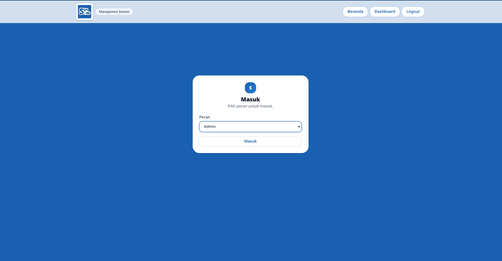
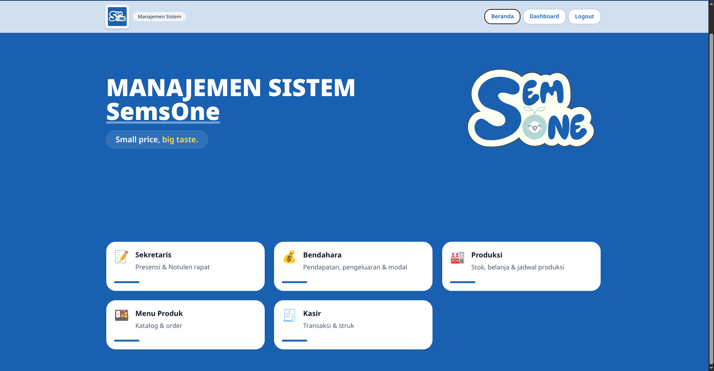
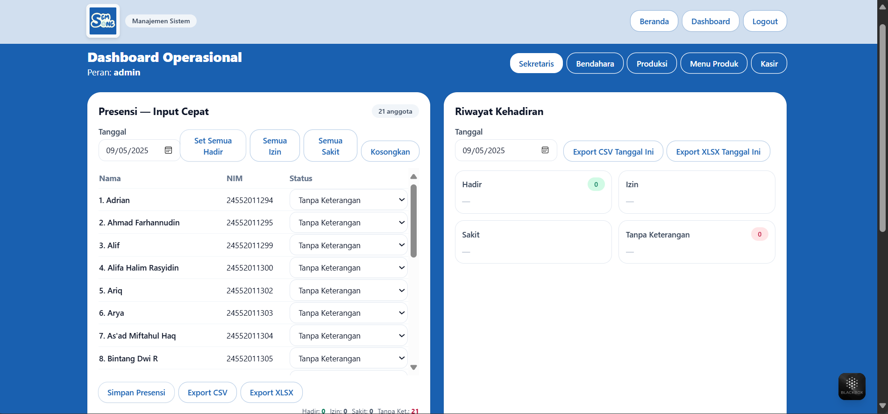
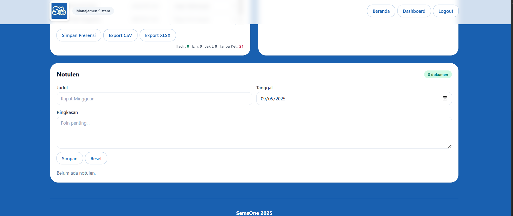
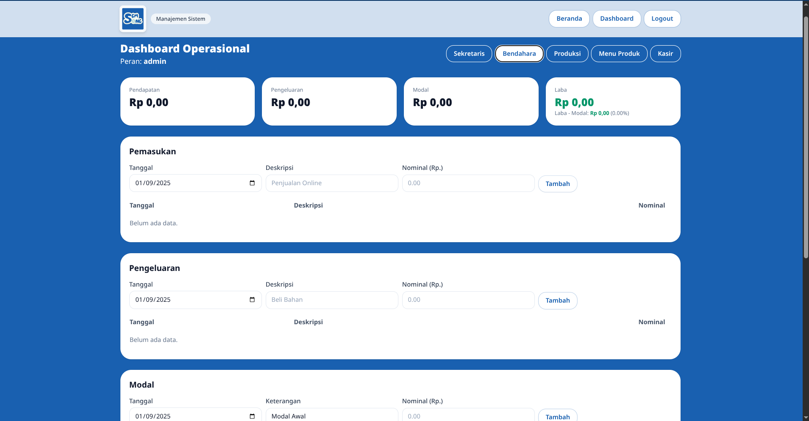
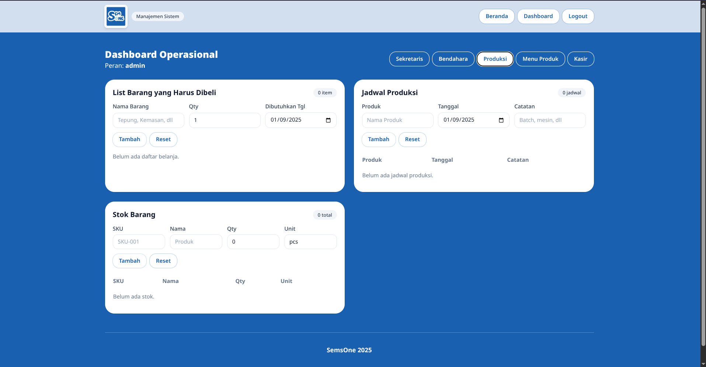
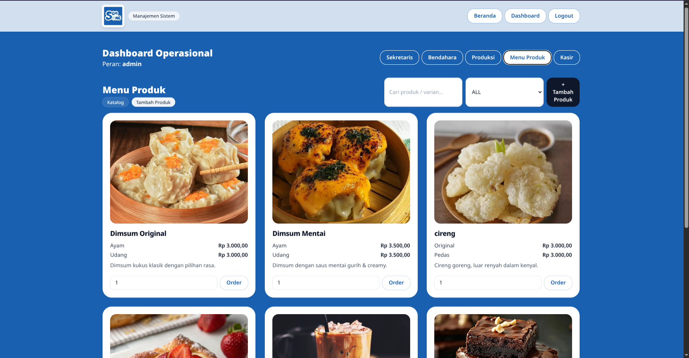
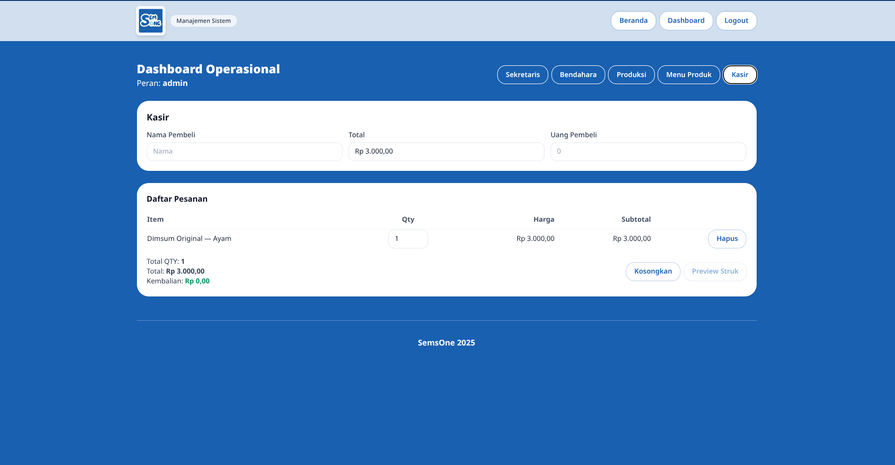
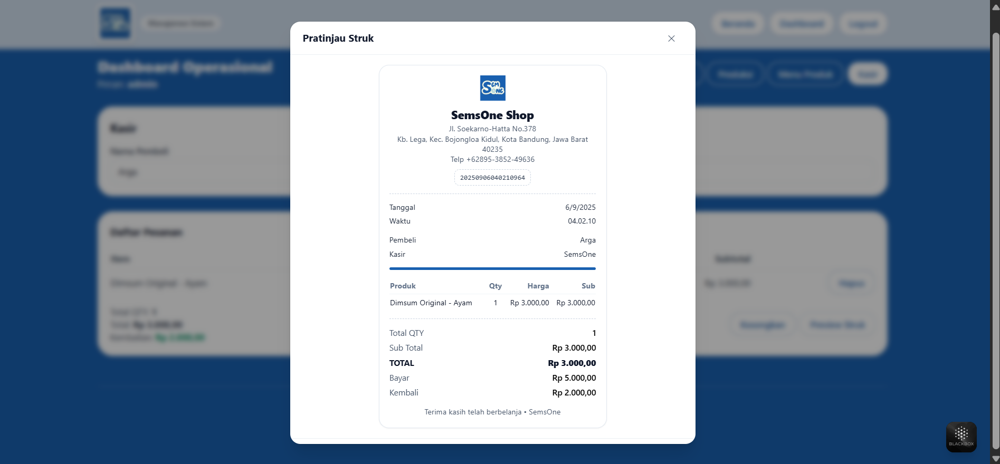

# 💼 SemsOne — Sistem Manajemen Operasional UKM

Selamat datang di repositori **SemsOne** – sebuah aplikasi web modern berbasis **React + TypeScript** untuk mengelola operasional UKM/organisasi.  
Sistem ini mencakup **presensi & notulen**, **keuangan**, **produksi**, **katalog produk**, hingga **kasir** (transaksi + cetak struk).  
Semua data tersimpan di **localStorage** sehingga dapat digunakan secara **offline**.

---

## 🎯 Fitur Utama

* **Beranda (Dashboard)**
  * Headline & deskripsi animasi (*small price, big taste*).
  * Navigasi cepat ke setiap modul (Sekretaris, Bendahara, Produksi, Produk, Kasir).

* **Sekretaris**
  * **Presensi** – input cepat per tanggal, set massal (Hadir/Izin/Sakit/Tanpa Ket.).
  * **Riwayat Kehadiran** – lihat siapa hadir/izin/sakit/TT sesuai tanggal input.
  * **Export CSV & XLSX**.
  * **Notulen Rapat** – simpan judul, tanggal, ringkasan; export **PDF**.

* **Bendahara**
  * **Catatan Pemasukan & Pengeluaran**.
  * **Kalkulator Harga Jual**:  
    ```
    (Modal + Biaya Operasional + (%Keuntungan × (Modal+Biaya))) ÷ Jumlah Produk
    ```
    Output otomatis dalam format **Rupiah**.

* **Produksi**
  * **Stok barang**, **daftar belanja**, dan **jadwal produksi**.
  * Modular dan mudah dikembangkan.

* **Menu Produk**
  * Daftar produk (Dimsum, Cireng, Pastry, Brownies, Kopi).
  * Gambar produk dari **galeri lokal** (bukan link).
  * Varian & harga jelas, search + filter kategori.
  * Hover → animasi zoom gambar & page.
  * Tombol **Order** + jumlah pcs.

* **Kasir**
  * Input **nama pembeli**, **uang pembayaran**, hitung **kembalian** otomatis.
  * Tabel pesanan (ubah qty, hapus item).
  * **Preview struk**.
  * **Download PNG** (via Canvas, stabil) & **Cetak** langsung.
  * Layout profesional: logo toko, tanggal & waktu, kasir, daftar item, total, bayar, kembalian.

---
```plaintext
src/
├── components/       # Komponen UI (Button, Card, Modal, dll.)
├── data/             # Data awal (produk, constants, anggota)
├── features/         # Modul: sekretaris, bendahara, produksi, produk, kasir
├── pages/            # Halaman utama (Beranda, Login)
├── utils/            # Helper export, storage, pricing
├── index.css         # Tailwind + animasi marquee
public/
├── images/           # Aset produk (dimsum1.jpg, cireng.jpg, pastry.jpg, dll.)
└── logo.png          # Logo utama
## 🖼️ Contoh Tampilan
```


## 🖼️ Tampilan Aplikasi

### 1. Login
Halaman autentikasi pengguna untuk masuk ke sistem.  


### 2. Dashboard Beranda
Navigasi ke semua modul melalui kartu interaktif.  


### 3. Sekretaris – Presensi & Riwayat
Input cepat kehadiran anggota + riwayat presensi per tanggal.  


### 4. Sekretaris – Notulen Rapat
Form input notulen lengkap dengan export ke PDF.  


### 5. Bendahara
Modul pencatatan pendapatan, pengeluaran, dan modal usaha.  


### 6. Produksi
Manajemen stok, belanja, dan jadwal produksi.  


### 7. Menu Produk
Katalog produk dengan varian & gambar (Dimsum, Brownies, Cireng, Pastry, dll).  


### 8. Kasir & Struk
Transaksi penjualan dengan preview struk (download PNG & cetak).  




---

## ⚙️ Teknologi yang Digunakan

* **Bahasa Pemrograman**: TypeScript
* **Framework**: React (Vite)
* **UI Styling**: Tailwind CSS
* **Animasi**: Framer Motion
* **Data Persistensi**: localStorage (`utils/storage.ts`)
* **Export**: CSV, XLSX, PDF, PNG

---

## 🔧 Prasyarat

* Node.js **>= 18**
* npm / yarn / pnpm

---

## 🚀 Instalasi & Menjalankan

### 1. Clone repo
```bash
git clone https://github.com/areksaxyz/Semsone
cd Semsone
npm install
```
atau
```
pnpm install
```
### Jalnkan development server
```
npm run dev
```


